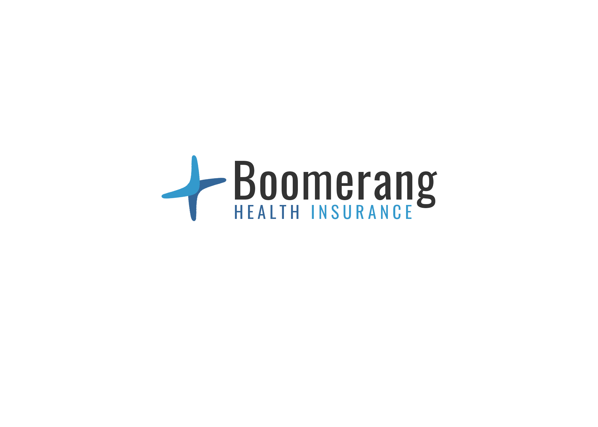
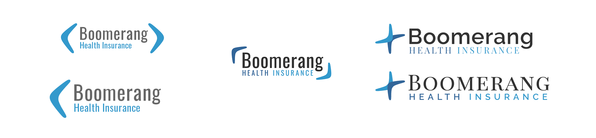
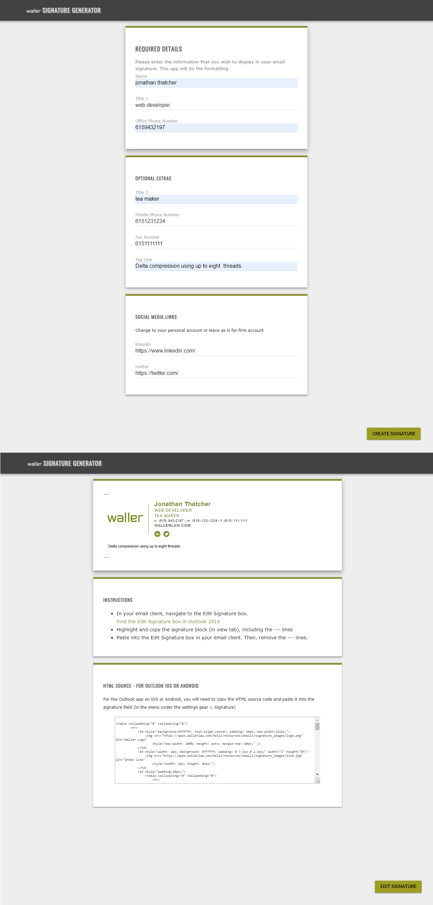
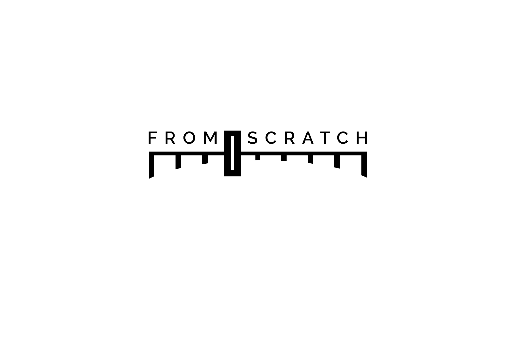
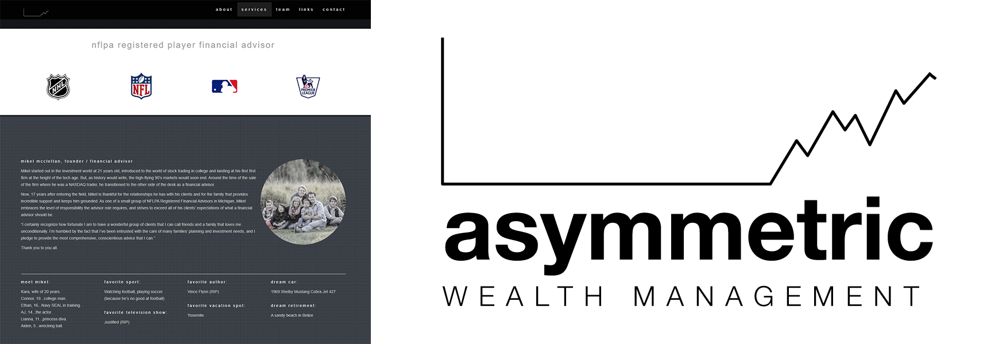

# Examples of Work
#### Contact Information: [thatcher@comsynth.com](mailto:thatcher@comsynth.com) // (+1) **615 943 2197**
> For examples of code, please visit https://github.com/comsynth?tab=repositories
## Identity, Concept and Branding for Health Insurance Company

 - Client: Boomerang Health Insurance
 - Brief: Create identity and brand for Health Insurance Company
 - Location: Nashville, TN, USA
 - Date: 2020
## Physical and digital packaging for Rock Band
.jpeg)
 - Client: Enation
 - Brief: Design physical and digital packaging for music release.
 - Location: Nashville, TN, USA
 - Colaborator: Richard Jackson @ Fifo
 - Date: 2018
## Company Signature Application

 - Client: Waller
 - Brief: Design and built one page application to uniform company signatures.
 - Location: Nashville, TN, USA
 - Colaborator: Fox Fuel Media
 - Date: 2020
An application 
## Branding for Art Collection

 - Client: Four Walls One Table
 - Brief: Create identity, brand and website art collection 
 - Location: Nashville, TN, USA
 - Date: 2018

## Branding for Music Blog

- Client: Jack Siggs - writer
 - Brief: Create identity and brand for music blog
 - Location: London, UK
 - Date: 2020
## Branding and Website for Ceramics Company

- Client: Particle Ceramics
 - Brief: Create brand for ceramics company
 - Location: Franklin, TN
 - Date: 2018
  - https://www.particleceramics.com/
## Branding for Application

- Client: Waller
 - Brief: Create brand and look ad feel for web application
 - Location: Nashville, TN
 - Date: 2019
 /examples_of_work/awm_final_downer.png
## Branding and Website

- Client: Asymmetric Weath Management
 - Brief: Create brand and Website for Wealth Management Company
 - Location: Adrian, MI
 - Date: 2017
 - http://www.comsynth.com/Asymmetric/index.html

## XD wire frame examples 

###### https://xd.adobe.com/view/ebaf7990-20fc-4ec9-5d16-b7529fcfbda1-9d9e/?fullscreen
#### Contact Information: [thatcher@comsynth.com](mailto:thatcher@comsynth.com) // (+1) **615 943 2197**

