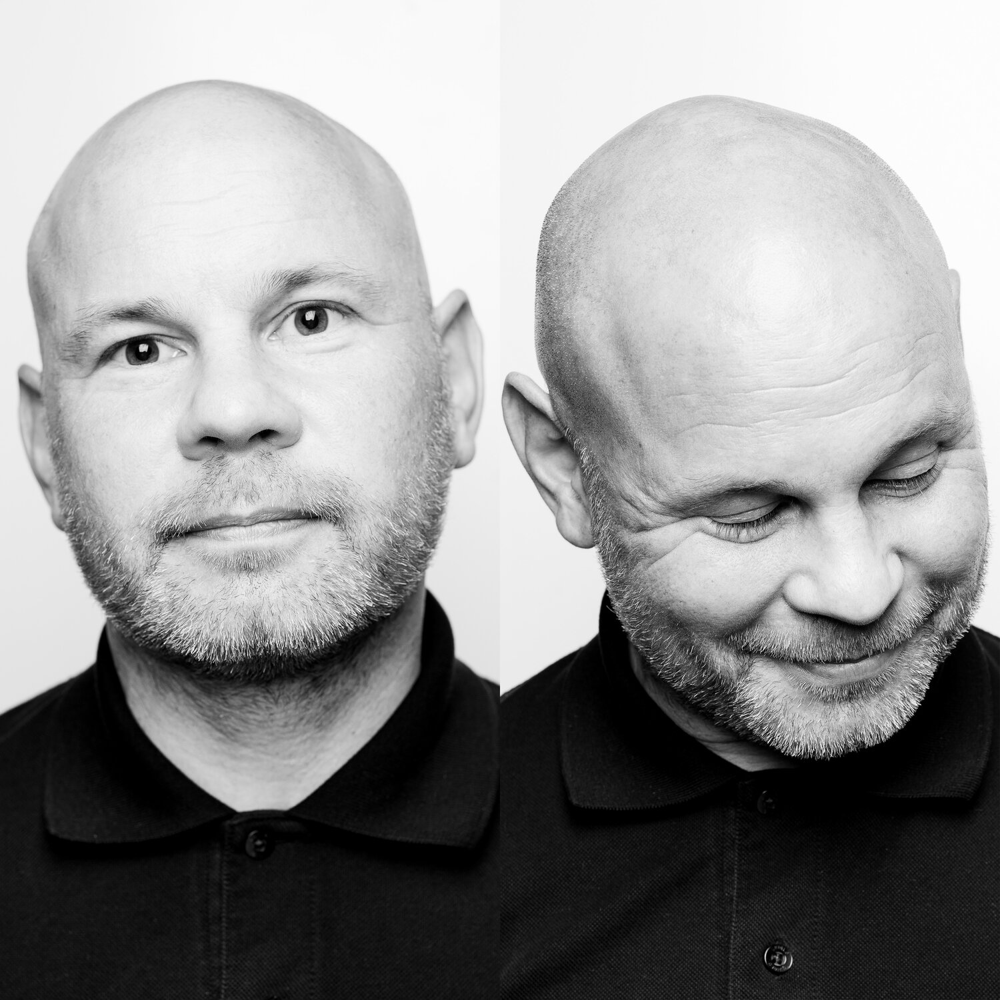

# Jonathan Thatcher 
### Creative Director - Frontend Developer - Artist
## Profile
> A relational creative, that finds beauty in silence and delights in noise. Experienced in working in diverse environments ranging from rock bands to law firms. Well travelled globally and cognitively.
## Objectives
To work for and with like minded professionals that will develop solutions that make this world a little better. To create, connect and belong within thriving workplace communities.
## Recent Endeavors
### Frontend Web Developer
- Company Name: Waller Lansden Dortch and Davis (a law firm).
- Dates Employed: Jul 2012 -  Present.
  - Designed and developed the firm's intranet. 
  - Designed and developed all internal applications (floor maps, directories, business solutions).
  - Tool set: VS code, XD, Photoshop, Illustrator, WordPress, Sharepoint, Github,  VUE, Angular. 
  - Primary Languages: CSS (SCSS) HTML, JS.
### Freelance Creative Director
- Company Name: Comsynth (a media agency).
- Dates Employed: Mar 2007 - July 2012.
  - Basic freelance necessities including book keeping and client relations. 
  - Branding projects including: Kia, One Sonic Society, Particle Ceramics, Jonathan Jackson + Enation, Elizabeth Smart, First Class Talent.
  - Learning new technologies when the budget is not flexible enough for outsourcing/collaboration.
  - Tool set: Photoshop, Illustrator, Wordpress.
### Professional Musician
- Company Name: Delirious (a rock band).
- Record Labels: Furious Records, Virgin Records, Sparrow Records, EMI.
- Dates Employed: Apr 1997 - Nov 2009. 
- Employment Duration: 12 yrs.
  - Bass Player - studio and touring .
  - Webmaster - created and maintained band website.
  - Songwriter - part of the writing process.
  - Producer -  part of the studio production team.
  - Video creation for live shows and promotional material.
  - Tool set: Fender P Bass, Ampeg SVT, 8x10, Reason, Logic, ProTools.
### Partner / Webmaster
- Company Name: Furious Records (an independent record label).
- Dates Employed: Jan 1996 - Nov 2009.
- Employment Duration: 13 yrs.
  - Founded, owned and directed a small business.
  - Created and maintained a family of websites. 
  - Ecommerce, email distribution, social media.
  - Tool set: Dreamweaver, WordPress, Final cut.
### Live Mix Engineer
- Company Name: A Marshall Hospitality (a restaurant owner).
- Dates Employed: June 2010 - June 2018.
  - Set up, tore down, mixed live artists.
  - Managed the scheduling of mix engineers.
  - Tool set: Ears and people skills.
### Farm Hand
- Company Name: Various Local Farms.
- Dates Employed: June 2010 - Present.
  - General farm work. Oversee 80 farm yard animals -  Weekend work for grounding and fun.
  - Tool set: Buckets and Wellington Boots.
## Personal Information
- Nationality: British, American.
- Permanent Residence: Franklin, TN, USA.
- Online: [GitHub](https://github.com/comsynth/resume/) // [LinkedIn](https://www.linkedin.com/in/arkyard/)
- Further Listening: [But Enough About Me - Pod Cast](https://podcasts.apple.com/us/podcast/ep-12-jon-thatcher/id1464781115?i=1000454409914)

## Examples of Work
https://github.com/comsynth/resume/blob/master/examplesofwork.md

## References
Doug Liens - CTO waller // 615 850 8693
Joel Lawler - Senior Developer Duff and Phelps // 615 384 1181
Michael Smallbone - Attorney // 615 260 2413
Richard Jackson - Designer // 818 512 0651 richardlee529@mac.com

## Contact Information
[thatcher@comsynth.com](mailto:thatcher@comsynth.com) // (+1) **615 943 2197**

